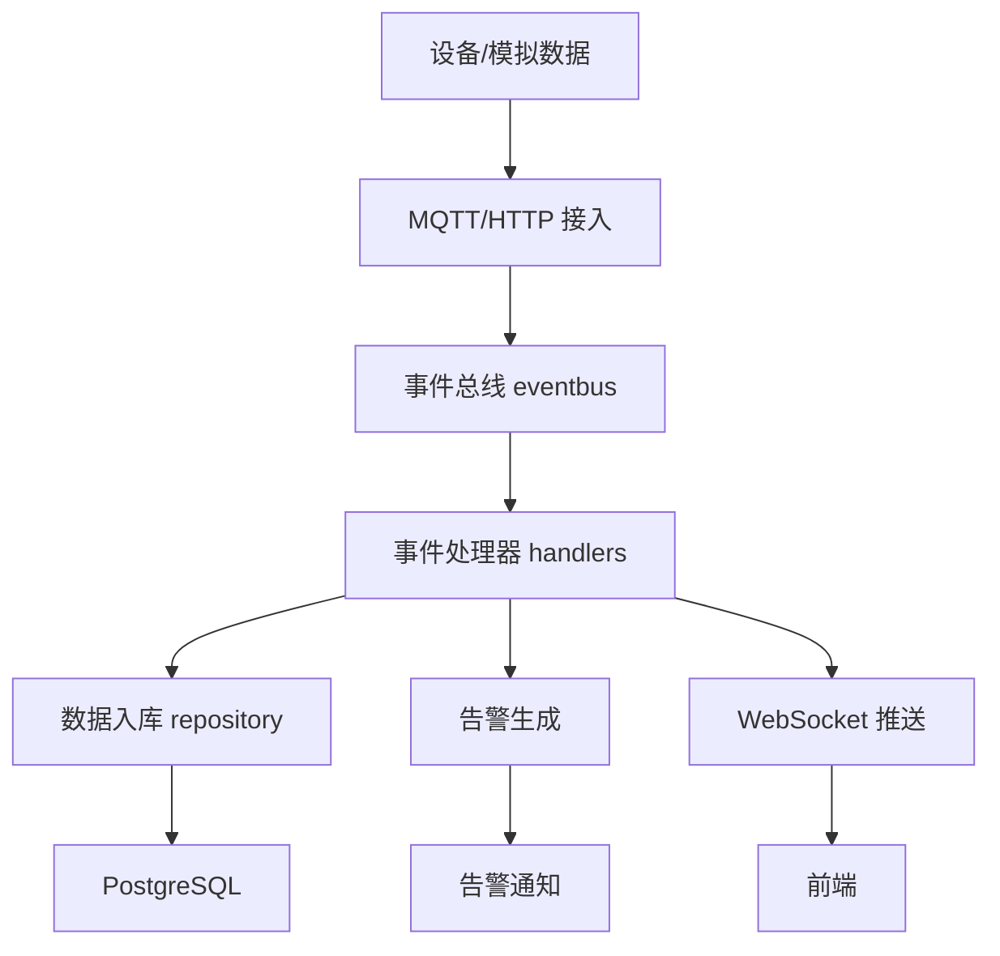

# 健康数据平台（health_DT_go）AI友好型开发方案

## 1. 技术栈推荐

- Web/API：Gin
- 数据库驱动：pgx v5
- ORM/查询：Ent
- 缓存：go-redis/redis/v8
- 消息队列：paho.mqtt.golang
- 异步任务：Asynq + goroutines/channels
- 配置管理：viper
- 日志：zap

---

## 2. 标准化目录结构

```plaintext
health_DT_go/
├─ cmd/
│  └─ server/           # 启动入口
│     └─ main.go
├─ config/              # 配置文件与解析
│  ├─ config.yaml
│  └─ config.go
├─ internal/
│  ├─ app/
│  │  ├─ eventbus/      # 事件总线
│  │  ├─ handlers/      # 事件处理器
│  │  │   ├─ health/                       # 所有健康数据相关处理器
│  │  │   │   ├─ base.go                   # 健康处理器基类（接口 + 通用方法）
│  │  │   │   ├─ heart_rate_handler.go     # 心率数据处理器
│  │  │   │   ├─ blood_pressure_handler.go # 血压数据处理器
│  │  │   │   ├─ spo2_handler.go           # 血氧数据处理器
│  │  │   │   └─ temperature_handler.go    # 体温数据处理器
│  │  └─ pipeline.go    # 数据处理主流程
│  ├─ models/           # 数据库模型
│  ├─ repository/       # 数据访问层
│  ├─ service/          # 业务逻辑层
│  ├─ ws/               # WebSocket服务
│  └─ mqtt/             # MQTT客户端
├─ api/
│  ├─ http/             # HTTP接口层
│  └─ grpc/             # gRPC接口定义
├─ pkg/
│  ├─ logger/           # 日志工具
│  ├─ utils/            # 通用工具函数
│  └─ error/            # 错误处理
├─ scripts/             # 辅助脚本
├─ migrations/          # 数据库迁移脚本
├─ go.mod
└─ go.sum
```

---

## 3. 核心模块职责说明

- [`cmd/server/main.go`](cmd/server/main.go:1)：项目启动，初始化所有核心组件
- [`internal/app/eventbus`](internal/app/eventbus:1)：事件发布与订阅
- [`internal/app/handlers`](internal/app/handlers:1)：处理健康数据、告警、鉴权、推送等事件
  - [`internal/app/handlers/health/base.go`](internal/app/handlers/health/base.go:1)：健康处理器基类（接口与通用方法）
  - [`internal/app/handlers/health/heart_rate_handler.go`](internal/app/handlers/health/heart_rate_handler.go:1)：心率数据处理器
  - [`internal/app/handlers/health/blood_pressure_handler.go`](internal/app/handlers/health/blood_pressure_handler.go:1)：血压数据处理器
  - [`internal/app/handlers/health/spo2_handler.go`](internal/app/handlers/health/spo2_handler.go:1)：血氧数据处理器
  - [`internal/app/handlers/health/temperature_handler.go`](internal/app/handlers/health/temperature_handler.go:1)：体温数据处理器
- [`internal/app/pipeline.go`](internal/app/pipeline.go:1)：统一接收并处理设备或模拟数据
- [`internal/models`](internal/models:1)：数据库表结构映射
- [`internal/repository`](internal/repository:1)：数据访问逻辑，封装数据库与缓存
- [`internal/service`](internal/service:1)：业务逻辑层，组合仓储、事件、处理器
- [`internal/ws`](internal/ws:1)：WebSocket连接与消息推送
- [`internal/mqtt`](internal/mqtt:1)：MQTT消息处理与事件转换
- [`api/http`](api/http:1)：HTTP接口路由、中间件、处理器
- [`api/grpc`](api/grpc:1)：gRPC接口定义
- [`pkg/logger`](pkg/logger:1)、[`pkg/utils`](pkg/utils:1)、[`pkg/error`](pkg/error:1)：通用工具包

---

## 4. 鉴权机制与角色说明

- 模型定义：[`internal/models/admin_user.go`](internal/models/admin_user.go:1)、[`app_user.go`](internal/models/app_user.go:1)、[`auth.go`](internal/models/auth.go:1)
- 数据访问：[`internal/repository/postgres/user_repo.go`](internal/repository/postgres/user_repo.go:1)、[`auth_repo.go`](internal/repository/postgres/auth_repo.go:1)
- 业务逻辑：[`internal/service/user_service.go`](internal/service/user_service.go:1)、[`auth_service.go`](internal/service/auth_service.go:1)
- 事件处理器：[`internal/app/handlers/auth_handler.go`](internal/app/handlers/auth_handler.go:1)、[`user_handler.go`](internal/app/handlers/user_handler.go:1)
- 路由/中间件：[`api/http/auth_routes.go`](api/http/auth_routes.go:1)、[`user_routes.go`](api/http/user_routes.go:1)、[`middleware.go`](api/http/middleware.go:1)
- 密码工具：[`pkg/utils/password.go`](pkg/utils/password.go:1)（bcrypt加密）

**鉴权流程：**
- 采用JWT进行Token认证
- 通过中间件校验接口权限
- 区分admin与app角色，便于权限管理

---

## 5. 系统特点与扩展性

- 事件驱动：设备数据、告警、推送均通过事件总线流转
- 支持模拟数据：可选择不入库，仅推送或缓存
- 异步批量处理：goroutines与队列提升入库性能
- 前后端解耦：WebSocket与HTTP接口独立部署
- Redis高并发：缓存最新状态与模拟数据，减轻数据库压力
- 高可扩展性：新增设备、事件、告警规则仅需添加Handler，无需改动核心流程

---

## 6. Mermaid 架构图（简化版）


