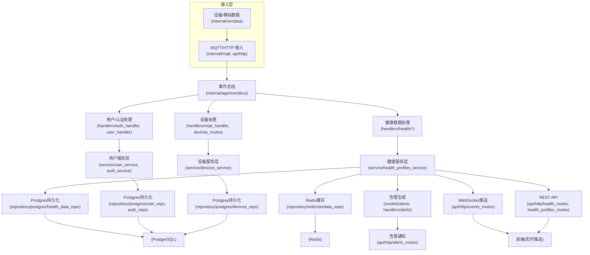

## 架构图

```mermaid
flowchart TD
    subgraph 接入层
        A["设备/模拟数据<br/>(internal/simdata)"] --> B["MQTT/HTTP 接入<br/>(internal/mqtt, api/http)"]
    end
    B --> C["事件总线<br/>(internal/app/eventbus)"]
    C --> D1["健康数据处理<br/>(handlers/health/*)"]
    C --> D2["用户/认证处理<br/>(handlers/auth_handler, user_handler)"]
    C --> D3["设备处理<br/>(handlers/mqtt_handler, devices_routes)"]
    D1 --> S1["健康服务层<br/>(service/health_profiles_service)"]
    D2 --> S2["用户服务层<br/>(service/user_service, auth_service)"]
    D3 --> S3["设备服务层<br/>(service/devices_service)"]
    S1 --> RP1["Postgres持久化<br/>(repository/postgres/health_data_repo)"]
    S2 --> RP2["Postgres持久化<br/>(repository/postgres/user_repo, auth_repo)"]
    S3 --> RP3["Postgres持久化<br/>(repository/postgres/devices_repo)"]
    S1 --> RC1["Redis缓存<br/>(repository/redis/simdata_repo)"]
    S1 --> AL["告警生成<br/>(models/alerts, handlers/alerts)"]
    AL --> AN["告警通知<br/>(api/http/alerts_routes)"]
    S1 --> WS["WebSocket推送<br/>(api/http/events_routes)"]
    S1 --> API["REST API<br/>(api/http/health_routes, health_profiles_routes)"]
    RP1 --> DB1["(PostgreSQL)"]
    RP2 --> DB1
    RP3 --> DB1
    RC1 --> DB2["(Redis)"]
    WS --> FE["前端(实时推送)"]
    API --> FE

```
